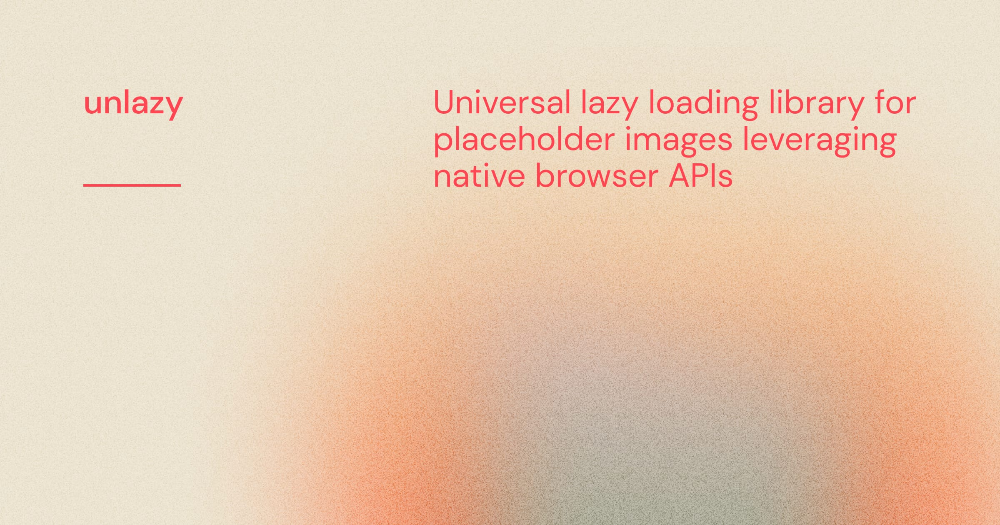

[](https://unlazy.byjohann.dev)

# unlazy

[](https://www.npmjs.com/package/unlazy)

Universal lazy loading library leveraging native browser APIs. It's intended to be used with the `loading="lazy"` attribute alongside (blurry) placeholder images and with a [BlurHash](https://unlazy.byjohann.dev/placeholders/blurhash) or [ThumbHash](https://unlazy.byjohann.dev/placeholders/thumbhash) string.

It's the modernized and now framework-agnostic rewrite of my [Loadeer.js](https://github.com/johannschopplich/loadeer) library, which uses an Intersection Observer to detect when an image enters the viewport.

## Features

- 🎀 **Native**: Utilizes the `loading="lazy"` attribute
- 🎛️ **Framework-agnostic**: Works with any framework or no framework at all
- 🌊 **BlurHash & ThumbHash support**: SSR & client-side [BlurHash](https://blurha.sh) and [ThumbHash](https://github.com/evanw/thumbhash) decoding
- 🪄 **Sizing**: Automatically calculates the `sizes` attribute
- 🔍 **SEO-friendly**: Detects search engine bots and preloads all images
- 🎟 **`<picture>`**: Supports multiple image tags
- 🏎 **Auto-initialize**: Usable without a build step

> **Note**
>
> Although the `loading="lazy"` attribute is supported in all major browsers, it is only available in Safari 16.4 (released March 2023) and later versions by default. It is important to consider this limitation when using unlazy for your project, as it might impact the user experience for visitors using older Safari versions or other unsupported browsers.

## Setup

> [📖 Read the documentation](https://unlazy.byjohann.dev)

```bash
# pnpm
pnpm add unlazy

# npm
npm i unlazy
```

## Basic Usage

> [📖 Read the documentation](https://unlazy.byjohann.dev)

To apply lazy loading to all images with the `loading="lazy"` attribute, import the [`lazyLoad`](https://unlazy.byjohann.dev/api/lazy-load) function and call it without any arguments:

```ts
import { lazyLoad } from 'unlazy'

// Apply lazy loading for all images by the selector `img[loading="lazy"]`
lazyLoad()
```

You can target specific images by passing a CSS selector, a DOM element, a list of DOM elements, or an array of DOM elements to lazy-load to [`lazyLoad`](https://unlazy.byjohann.dev/api/lazy-load).

## 💻 Development

1. Clone this repository
2. Enable [Corepack](https://github.com/nodejs/corepack) using `corepack enable`
3. Install dependencies using `pnpm install`
4. Run `pnpm run dev:prepare`
5. Start development server using `pnpm run dev` inside the one of the `packages` directories

## License

[MIT](./LICENSE) License © 2023-present [Johann Schopplich](https://github.com/johannschopplich)
